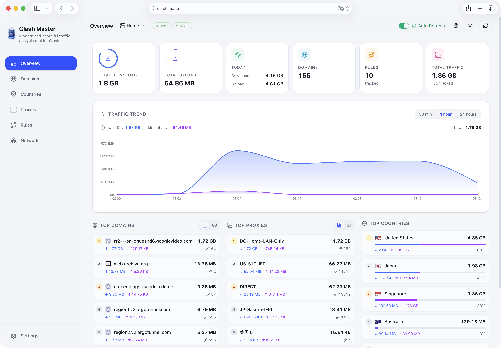

<p align="center">
  
  <br>
  <b style="font-size: 32px;">Clash Master</b>
</p>

<p align="center">
  <b>优雅且现代化的 OpenClash 流量可视化分析工具</b><br>
  <span>实时监控 · 多维度分析 · 多后端管理</span>
</p>

<p align="center">
  <a href="https://github.com/foru17/clash-master/stargazers"></a>
  <a href="https://hub.docker.com/r/foru17/clash-master"></a>
  <a href="https://hub.docker.com/r/foru17/clash-master"></a>
  <a href="https://github.com/foru17/clash-master/blob/main/LICENSE"></a>
  
</p>

<p align="center">
  <b>简体中文</b> •
  <a href="./README.en.md">English</a>
</p>




## 📋 目录

- [🚀 快速开始](#-快速开始)
- [📖 首次使用](#-首次使用)
- [🔧 端口冲突解决](#-端口冲突解决)
- [🐳 Docker 配置](#-docker-配置)
- [📦 Unraid 安装](#-unraid-安装)
- [❓ 常见问题](#-常见问题)
- [📁 项目结构](#-项目结构)
- [🛠️ 技术栈](#️-技术栈)
- [📄 许可证](#-许可证)

## 🚀 快速开始

### 方式一：Docker Compose（推荐）

创建 `docker-compose.yml`：

```yaml
services:
  clash-master:
    image: foru17/clash-master:latest
    container_name: clash-master
    restart: unless-stopped
    ports:
      - "3000:3000" # Web UI
      - "3001:3001" # API
      - "3002:3002" # WebSocket
    volumes:
      - ./data:/app/data
    environment:
      - NODE_ENV=production
      # 外部端口（可选，默认即为 3000/3001/3002）
      - WEB_EXTERNAL_PORT=3000
      - API_EXTERNAL_PORT=3001
      - WS_EXTERNAL_PORT=3002
      - DB_PATH=/app/data/stats.db
```

启动服务：

```bash
docker compose up -d
```

访问 <http://localhost:3000>

### 方式二：Docker 直接运行

```bash
# 最简（推荐，仅 Web 反代）：
docker run -d \
  --name clash-master \
  -p 3000:3000 \
  -v $(pwd)/data:/app/data \
  --restart unless-stopped \
  foru17/clash-master:latest
```

访问 <http://localhost:3000>

### 方式三：一键脚本

自动检测端口冲突并配置，适合不熟悉 Docker 的用户：

```bash
# 使用 curl
curl -fsSL https://raw.githubusercontent.com/foru17/clash-master/main/setup.sh | bash

# 或使用 wget
wget -qO- https://raw.githubusercontent.com/foru17/clash-master/main/setup.sh | bash
```

### 方式四：源码运行

```bash
# 1. 克隆仓库
git clone https://github.com/foru17/clash-master.git
cd clash-master

# 2. 安装依赖
pnpm install

# 3. 启动开发服务
pnpm dev
```

## 📖 首次使用


1. 打开 <http://localhost:3000>
2. 首次访问会弹出**后端配置**对话框
3. 填写 OpenClash 连接信息：
   - **名称**: 自定义名称（如 "Home"）
   - **地址**: OpenClash 后端地址（如 `192.168.101.1`）
   - **端口**: OpenClash 后端端口（如 `9090`）
   - **Token**: 如果配置了 Secret 则填写，否则留空
4. 点击「添加后端」保存配置
5. 系统将自动开始采集数据

> 💡 **获取 OpenClash 地址**: 进入 OpenClash 插件 → 打开「外部控制」→ 复制地址

## 🔧 端口冲突解决

如果看到错误提示端口已被占用，有以下几种解决方案：

### 方案 1：使用 .env 文件

创建 `.env` 文件（与 `docker-compose.yml` 同目录）：

```env
WEB_EXTERNAL_PORT=8080    # 修改 Web UI 端口
API_EXTERNAL_PORT=8081    # 修改 API 端口
WS_EXTERNAL_PORT=8082     # 修改 WebSocket 端口
```

然后重启：

```bash
docker compose down
docker compose up -d
```

### 方案 2：直接修改 docker-compose.yml

```yaml
ports:
  - "8080:3000" # 外部 8080 → 内部 3000
  - "8081:3001" # 外部 8081 → 内部 3001
  - "8082:3002" # 外部 8082 → 内部 3002
```

> 说明：前端会在运行时读取外部端口配置，无需再设置 `NEXT_PUBLIC_WS_PORT`。

## 🐳 Docker 配置

### 端口说明

| 端口 |   用途    | 外部必需 | 说明 |
| :--: | :-------: | :------: | :--- |
| 3000 | Web 界面  |   ✅     | 前端访问入口 |
| 3001 | API 接口  |   可选   | 仅直连/调试时需要；前端默认走 `/api` |
| 3002 | WebSocket |   可选   | 实时数据推送；可通过 Nginx `/ws` 代理 |

> 只配置主站 Web 的 Nginx 反代即可：前端默认同域访问 `/api`，无需额外暴露或配置 3001/3002。

### 多架构支持

Docker 镜像同时支持 `linux/amd64` 和 `linux/arm64`。

## 📦 Unraid 安装

对于 Unraid 用户，可以通过以下方式安装：

1. **手动添加模板**：
   - 将 `unraid-template.xml` 的内容保存到 Unraid 闪存盘的 `/boot/config/plugins/dockerMan/templates-user/ClashMaster.xml`
   - 在 Unraid WebUI 的 Docker 页面点击 "Add Container"，在模板选择中找到 "ClashMaster"

2. **配置说明**：
   - **Web UI Port**: 默认 3000
   - **API Port**: 默认 3001
   - **WebSocket Port**: 默认 3002
   - **Data Path**: 映射到 `/app/data`，用于存储 SQLite 数据库

> 💡 **注意**: 如果修改了 WebSocket 的外部映射端口，请务必同步修改 `WS_EXTERNAL_PORT` 环境变量，以确保前端能正确连接到 WebSocket。

## 📁 项目结构

```
clash-master/
├── docker-compose.yml      # Docker Compose 配置
├── Dockerfile              # Docker 镜像构建
├── setup.sh                # 一键配置脚本
├── docker-start.sh         # Docker 容器启动脚本
├── unraid-template.xml     # Unraid 容器模板 ⭐
└── apps/
    ├── collector/          # 数据收集服务
    └── web/                # Next.js 前端应用
```

## 🛠️ 技术栈

- **前端**: Next.js 16 + React 19 + TypeScript + Tailwind CSS
- **数据收集**: Node.js + Fastify + WebSocket + SQLite
- **部署**: Docker + Docker Compose

## 📄 许可证

MIT License © 2024 [foru17](https://github.com/foru17)
